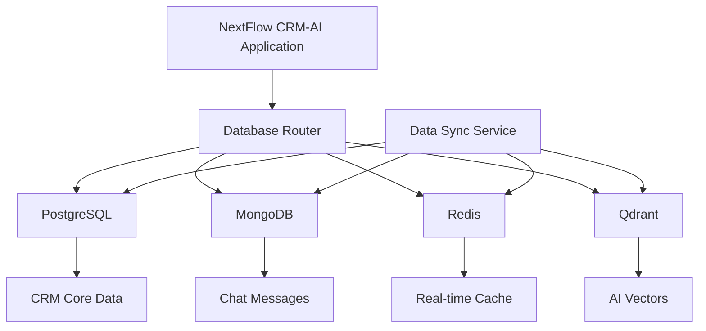
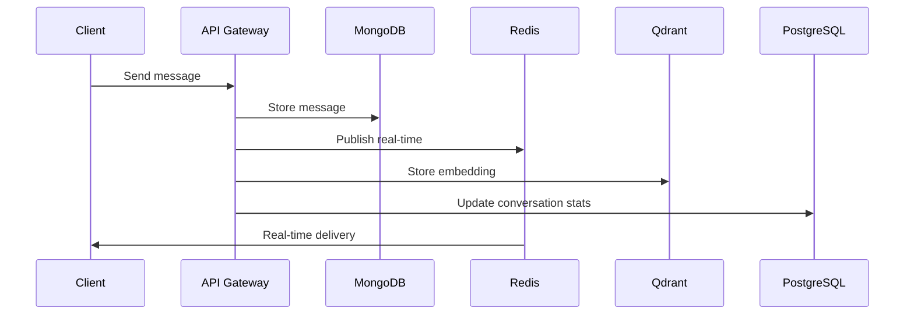

# KIẾN TRÚC ĐA DATABASE - NextFlow CRM-AI v2.0.0

## Mục lục

1. [TỔNG QUAN KIẾN TRÚC](#1-tổng-quan-kiến-trúc)
2. [POSTGRESQL - CRM CORE](#2-postgresql---crm-core)
3. [MONGODB - CHAT & MESSAGES](#3-mongodb---chat--messages)
4. [REDIS - REAL-TIME & CACHE](#4-redis---real-time--cache)
5. [QDRANT - AI VECTOR SEARCH](#5-qdrant---ai-vector-search)
6. [DATA FLOW & INTEGRATION](#6-data-flow--integration)
7. [PERFORMANCE & SCALING](#7-performance--scaling)
8. [BACKUP & RECOVERY](#8-backup--recovery)

## 1. TỔNG QUAN KIẾN TRÚC

### 1.1. Lý do sử dụng Multi-Database

NextFlow CRM-AI sử dụng kiến trúc đa database để tối ưu hóa hiệu suất và khả năng mở rộng:

```yaml
Database Strategy:
  PostgreSQL: Structured CRM data (ACID compliance)
  MongoDB: Unstructured chat data (High throughput)
  Redis: Real-time & caching (Low latency)
  Qdrant: AI vector search (Semantic search)
```

### 1.2. Kiến trúc tổng thể



### 1.3. Data Distribution Strategy

| Data Type | Primary DB | Secondary | Reason |
|-----------|------------|-----------|---------|
| Users, Organizations | PostgreSQL | Redis (cache) | ACID compliance |
| Customer Records | PostgreSQL | Redis (cache) | Complex relationships |
| Chat Messages | MongoDB | Redis (real-time) | High write volume |
| File Attachments | MongoDB GridFS | - | Large binary data |
| AI Embeddings | Qdrant | - | Vector similarity |
| Session Data | Redis | - | Temporary data |

## 2. POSTGRESQL - CRM CORE

### 2.1. Mục đích sử dụng

PostgreSQL làm primary database cho tất cả dữ liệu CRM cốt lõi:

```yaml
Core Entities:
  - users: Người dùng hệ thống
  - organizations: Tổ chức/công ty
  - customers: Khách hàng
  - leads: Khách hàng tiềm năng
  - opportunities: Cơ hội bán hàng
  - products: Sản phẩm/dịch vụ
  - orders: Đơn hàng
  - invoices: Hóa đơn
```

### 2.2. Configuration

```sql
-- Database configuration
CREATE DATABASE nextflow_crm 
WITH 
  ENCODING = 'UTF8'
  LC_COLLATE = 'en_US.UTF-8'
  LC_CTYPE = 'en_US.UTF-8'
  TEMPLATE = template0;

-- Extensions
CREATE EXTENSION IF NOT EXISTS "uuid-ossp";
CREATE EXTENSION IF NOT EXISTS "pg_trgm";
CREATE EXTENSION IF NOT EXISTS "btree_gin";
```

### 2.3. Connection Settings

```yaml
PostgreSQL Config:
  host: localhost
  port: 5432
  database: nextflow_crm
  max_connections: 200
  shared_buffers: 256MB
  effective_cache_size: 1GB
  work_mem: 4MB
```

## 3. MONGODB - CHAT & MESSAGES

### 3.1. Mục đích sử dụng

MongoDB chuyên xử lý chat messages và dữ liệu không cấu trúc:

```yaml
Collections:
  - conversations: Cuộc hội thoại
  - messages: Tin nhắn chat
  - attachments: File đính kèm
  - bot_interactions: Tương tác với AI bot
  - message_archives: Lưu trữ tin nhắn cũ
```

### 3.2. Schema Design

#### 3.2.1. Conversations Collection

```javascript
// conversations collection
{
  "_id": ObjectId("..."),
  "tenant_id": "tenant_123",
  "conversation_id": "conv_456",
  "participants": [
    {
      "user_id": "user_789",
      "role": "customer|agent|bot",
      "joined_at": ISODate("2024-12-01T10:00:00Z")
    }
  ],
  "channel": "facebook|zalo|website|whatsapp",
  "status": "active|closed|archived",
  "metadata": {
    "customer_id": "cust_123",
    "assigned_agent": "agent_456",
    "tags": ["support", "billing"],
    "priority": "high|medium|low"
  },
  "created_at": ISODate("2024-12-01T10:00:00Z"),
  "updated_at": ISODate("2024-12-01T15:30:00Z")
}
```

#### 3.2.2. Messages Collection

```javascript
// messages collection
{
  "_id": ObjectId("..."),
  "tenant_id": "tenant_123",
  "conversation_id": "conv_456",
  "message_id": "msg_789",
  "sender": {
    "id": "user_123",
    "type": "customer|agent|bot",
    "name": "John Doe"
  },
  "content": {
    "type": "text|image|file|audio|video",
    "text": "Hello, I need help with my order",
    "attachments": [
      {
        "file_id": "file_123",
        "filename": "screenshot.png",
        "size": 1024000,
        "mime_type": "image/png"
      }
    ]
  },
  "timestamp": ISODate("2024-12-01T10:05:00Z"),
  "status": {
    "sent": true,
    "delivered": true,
    "read": false,
    "read_at": null
  },
  "ai_processed": {
    "sentiment": "neutral",
    "intent": "support_request",
    "entities": ["order", "help"],
    "confidence": 0.85
  }
}
```

### 3.3. Indexing Strategy

```javascript
// Indexes for optimal performance
db.conversations.createIndex({ "tenant_id": 1, "status": 1 });
db.conversations.createIndex({ "participants.user_id": 1 });
db.conversations.createIndex({ "created_at": -1 });

db.messages.createIndex({ "tenant_id": 1, "conversation_id": 1, "timestamp": -1 });
db.messages.createIndex({ "sender.id": 1, "timestamp": -1 });
db.messages.createIndex({ "content.text": "text" }); // Full-text search
```

### 3.4. Configuration

```yaml
MongoDB Config:
  host: localhost
  port: 27017
  database: nextflow_chat
  replica_set: rs0
  max_pool_size: 100
  write_concern: majority
  read_preference: primaryPreferred
```

## 4. REDIS - REAL-TIME & CACHE

### 4.1. Mục đích sử dụng

Redis xử lý real-time messaging và caching:

```yaml
Use Cases:
  - Real-time message delivery (Pub/Sub)
  - Online user presence
  - Message queues
  - Session storage
  - Frequently accessed data cache
  - Rate limiting
```

### 4.2. Data Structures

#### 4.2.1. Real-time Messaging

```redis
# Pub/Sub channels
PUBLISH chat:tenant_123:conv_456 '{"message_id":"msg_789","content":"Hello"}'

# Online users (Sorted Set)
ZADD online_users:tenant_123 1701432000 user_456
ZADD online_users:tenant_123 1701432000 user_789

# Message queues (List)
LPUSH message_queue:agent_123 '{"conversation_id":"conv_456","priority":"high"}'
```

#### 4.2.2. Caching Strategy

```redis
# User cache (Hash)
HSET user:123 name "John Doe" email "john@example.com" role "agent"
EXPIRE user:123 3600

# Conversation cache (String - JSON)
SET conv:456 '{"id":"conv_456","status":"active","participants":[...]}'
EXPIRE conv:456 1800

# Frequently accessed customers (Hash)
HSET customer:789 name "ABC Company" status "active" last_contact "2024-12-01"
EXPIRE customer:789 7200
```

### 4.3. Configuration

```yaml
Redis Config:
  host: localhost
  port: 6379
  database: 0
  max_connections: 100
  timeout: 5000
  retry_attempts: 3
  
Memory Management:
  maxmemory: 2gb
  maxmemory_policy: allkeys-lru
  save: "900 1 300 10 60 10000"
```

## 5. QDRANT - AI VECTOR SEARCH

### 5.1. Mục đích sử dụng

Qdrant lưu trữ vector embeddings cho AI features:

```yaml
Collections:
  - message_embeddings: Vector của tin nhắn
  - customer_embeddings: Vector profile khách hàng
  - product_embeddings: Vector sản phẩm
  - knowledge_base: Vector knowledge base
```

### 5.2. Collection Schema

```python
# Message embeddings collection
{
    "collection_name": "message_embeddings",
    "vectors": {
        "size": 1536,  # OpenAI embedding size
        "distance": "Cosine"
    },
    "payload_schema": {
        "tenant_id": "keyword",
        "message_id": "keyword", 
        "conversation_id": "keyword",
        "content": "text",
        "timestamp": "datetime",
        "intent": "keyword",
        "sentiment": "keyword"
    }
}
```

### 5.3. Configuration

```yaml
Qdrant Config:
  host: localhost
  port: 6333
  grpc_port: 6334
  collection_config:
    replication_factor: 1
    write_consistency_factor: 1
    on_disk_payload: true
```

## 6. DATA FLOW & INTEGRATION

### 6.1. Message Flow



### 6.2. Data Synchronization

```python
# Data sync service example
class DataSyncService:
    def sync_conversation_stats(self, conversation_id):
        # Get message count from MongoDB
        message_count = mongodb.messages.count_documents({
            "conversation_id": conversation_id
        })
        
        # Update PostgreSQL
        postgresql.execute("""
            UPDATE conversations 
            SET message_count = %s, updated_at = NOW()
            WHERE conversation_id = %s
        """, [message_count, conversation_id])
        
        # Update Redis cache
        redis.hset(f"conv:{conversation_id}", "message_count", message_count)
```

## 7. PERFORMANCE & SCALING

### 7.1. Read/Write Patterns

```yaml
PostgreSQL:
  Read: Heavy (reports, analytics)
  Write: Medium (CRM operations)
  Pattern: Complex queries, joins

MongoDB:
  Read: Medium (chat history)
  Write: Very Heavy (real-time messages)
  Pattern: Sequential, time-based

Redis:
  Read: Very Heavy (cache, real-time)
  Write: Heavy (cache updates)
  Pattern: Key-value, pub/sub

Qdrant:
  Read: Medium (AI search)
  Write: Medium (embedding updates)
  Pattern: Vector similarity
```

### 7.2. Scaling Strategy

```yaml
PostgreSQL:
  - Read replicas for reporting
  - Connection pooling
  - Query optimization
  - Partitioning by tenant

MongoDB:
  - Sharding by tenant_id
  - Replica sets for HA
  - Time-based collections
  - Archive old messages

Redis:
  - Redis Cluster for scaling
  - Separate instances by use case
  - Memory optimization

Qdrant:
  - Distributed collections
  - Quantization for memory
  - Separate collections by tenant
```

## 8. BACKUP & RECOVERY

### 8.1. Backup Strategy

```yaml
PostgreSQL:
  - Daily full backup
  - WAL archiving
  - Point-in-time recovery
  - Cross-region replication

MongoDB:
  - Daily mongodump
  - Oplog backup
  - Replica set backup
  - Sharded cluster backup

Redis:
  - RDB snapshots
  - AOF persistence
  - Backup to S3
  - Master-slave replication

Qdrant:
  - Collection snapshots
  - Backup to object storage
  - Distributed backup
```

### 8.2. Recovery Procedures

```bash
# PostgreSQL recovery
pg_basebackup -h backup-server -D /var/lib/postgresql/data -U postgres -v -P

# MongoDB recovery
mongorestore --host localhost:27017 --db nextflow_chat /backup/mongodb/

# Redis recovery
redis-server --appendonly yes --appendfilename backup.aof

# Qdrant recovery
curl -X POST "http://localhost:6333/collections/message_embeddings/snapshots/upload"
```

---

*Tài liệu được cập nhật lần cuối: Tháng 12/2024*
*Phiên bản: NextFlow CRM-AI v2.0.0*
