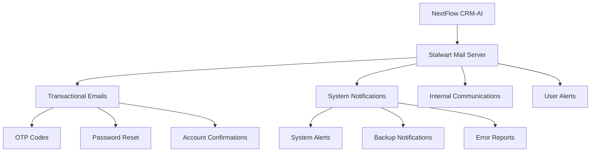

# CẤU HÌNH STALWART MAIL SERVER CHO NEXTFLOW CRM-AI

## Mục lục

1. [GIỚI THIỆU](#1-giới-thiệu)
2. [YÊU CẦU HỆ THỐNG](#2-yêu-cầu-hệ-thống)
3. [CÀI ĐẶT STALWART MAIL](#3-cài-đặt-stalwart-mail)
4. [CẤU HÌNH CƠ BẢN](#4-cấu-hình-cơ-bản)
5. [CẤU HÌNH BẢO MẬT](#5-cấu-hình-bảo-mật)
6. [TÍCH HỢP VỚI NEXTFLOW](#6-tích-hợp-với-nextflow)
7. [MONITORING VÀ LOGGING](#7-monitoring-và-logging)
8. [BACKUP VÀ RECOVERY](#8-backup-và-recovery)

## 1. GIỚI THIỆU

Stalwart Mail là mail server mã nguồn mở được NextFlow CRM-AI sử dụng để xử lý tất cả email hệ thống. Việc tự triển khai Stalwart Mail giúp:

- **Giảm chi phí**: Không phí license, chỉ trả phí server
- **Tăng bảo mật**: Dữ liệu email không rời khỏi hệ thống
- **Kiểm soát hoàn toàn**: Tùy chỉnh theo nhu cầu cụ thể
- **Tuân thủ GDPR**: Dữ liệu khách hàng được bảo vệ

### 1.1. Vai trò trong NextFlow CRM-AI



## 2. YÊU CẦU HỆ THỐNG

### 2.1. Phần cứng tối thiểu

```yaml
Server Requirements:
  CPU: 2 cores (4 cores khuyến nghị)
  RAM: 4GB (8GB khuyến nghị)
  Storage: 50GB SSD (100GB khuyến nghị)
  Network: 100Mbps (1Gbps khuyến nghị)
  
Operating System:
  - Ubuntu 22.04 LTS (khuyến nghị)
  - CentOS 8/9
  - Debian 11/12
```

### 2.2. Phần mềm cần thiết

```bash
# Cập nhật hệ thống
sudo apt update && sudo apt upgrade -y

# Cài đặt dependencies
sudo apt install -y curl wget gnupg2 software-properties-common
sudo apt install -y nginx certbot python3-certbot-nginx
sudo apt install -y fail2ban ufw
```

## 3. CÀI ĐẶT STALWART MAIL

### 3.1. Download và cài đặt

```bash
# Tạo user cho Stalwart Mail
sudo useradd -r -s /bin/false stalwart-mail

# Tạo thư mục
sudo mkdir -p /opt/stalwart-mail
sudo mkdir -p /var/lib/stalwart-mail
sudo mkdir -p /var/log/stalwart-mail

# Download Stalwart Mail
cd /tmp
wget https://github.com/stalwartlabs/mail-server/releases/latest/download/stalwart-mail-x86_64-unknown-linux-gnu.tar.gz

# Giải nén và cài đặt
tar -xzf stalwart-mail-x86_64-unknown-linux-gnu.tar.gz
sudo mv stalwart-mail /opt/stalwart-mail/
sudo chown -R stalwart-mail:stalwart-mail /opt/stalwart-mail
sudo chown -R stalwart-mail:stalwart-mail /var/lib/stalwart-mail
sudo chown -R stalwart-mail:stalwart-mail /var/log/stalwart-mail
```

### 3.2. Tạo systemd service

```bash
sudo tee /etc/systemd/system/stalwart-mail.service > /dev/null <<EOF
[Unit]
Description=Stalwart Mail Server
After=network.target

[Service]
Type=simple
User=stalwart-mail
Group=stalwart-mail
ExecStart=/opt/stalwart-mail/stalwart-mail --config /etc/stalwart-mail/config.toml
Restart=always
RestartSec=5
StandardOutput=journal
StandardError=journal

[Install]
WantedBy=multi-user.target
EOF

sudo systemctl daemon-reload
sudo systemctl enable stalwart-mail
```

## 4. CẤU HÌNH CƠ BẢN

### 4.1. File cấu hình chính

```bash
sudo mkdir -p /etc/stalwart-mail
sudo tee /etc/stalwart-mail/config.toml > /dev/null <<EOF
# Stalwart Mail Configuration for NextFlow CRM-AI

[server]
hostname = "mail.nextflow-crm.com"
max-connections = 1000

[server.listener."smtp"]
bind = ["0.0.0.0:25", "0.0.0.0:587"]
protocol = "smtp"

[server.listener."submission"]
bind = ["0.0.0.0:587"]
protocol = "smtp"
tls.implicit = false

[server.listener."submissions"]
bind = ["0.0.0.0:465"]
protocol = "smtp"
tls.implicit = true

[server.listener."imap"]
bind = ["0.0.0.0:143"]
protocol = "imap"

[server.listener."imaps"]
bind = ["0.0.0.0:993"]
protocol = "imap"
tls.implicit = true

[server.listener."http"]
bind = ["127.0.0.1:8080"]
protocol = "http"

# TLS Configuration
[certificate."default"]
cert = "/etc/letsencrypt/live/mail.nextflow-crm.com/fullchain.pem"
private-key = "/etc/letsencrypt/live/mail.nextflow-crm.com/privkey.pem"

# Database Configuration
[store."data"]
type = "sqlite"
path = "/var/lib/stalwart-mail/data.db"

[store."blob"]
type = "fs"
path = "/var/lib/stalwart-mail/blobs"

# Authentication
[directory."local"]
type = "sql"
store = "data"

# Logging
[tracer."stdout"]
type = "stdout"
level = "info"

[tracer."file"]
type = "file"
path = "/var/log/stalwart-mail/mail.log"
level = "debug"
EOF
```

### 4.2. Cấu hình DNS

```bash
# Thêm các DNS records sau vào domain nextflow-crm.com:

# A Record
mail.nextflow-crm.com.     IN  A       YOUR_SERVER_IP

# MX Record  
nextflow-crm.com.          IN  MX  10  mail.nextflow-crm.com.

# SPF Record
nextflow-crm.com.          IN  TXT     "v=spf1 mx include:mail.nextflow-crm.com ~all"

# DMARC Record
_dmarc.nextflow-crm.com.   IN  TXT     "v=DMARC1; p=quarantine; rua=mailto:dmarc@nextflow-crm.com"
```

## 5. CẤU HÌNH BẢO MẬT

### 5.1. SSL/TLS Certificate

```bash
# Cài đặt Let's Encrypt certificate
sudo certbot certonly --nginx -d mail.nextflow-crm.com

# Tự động gia hạn
sudo crontab -e
# Thêm dòng sau:
0 12 * * * /usr/bin/certbot renew --quiet && systemctl reload stalwart-mail
```

### 5.2. Firewall Configuration

```bash
# Cấu hình UFW
sudo ufw allow 22/tcp      # SSH
sudo ufw allow 25/tcp      # SMTP
sudo ufw allow 587/tcp     # SMTP Submission
sudo ufw allow 465/tcp     # SMTPS
sudo ufw allow 143/tcp     # IMAP
sudo ufw allow 993/tcp     # IMAPS
sudo ufw allow 80/tcp      # HTTP (cho Let's Encrypt)
sudo ufw allow 443/tcp     # HTTPS

sudo ufw enable
```

### 5.3. Fail2Ban Configuration

```bash
sudo tee /etc/fail2ban/jail.d/stalwart-mail.conf > /dev/null <<EOF
[stalwart-smtp]
enabled = true
port = smtp,465,587
filter = stalwart-smtp
logpath = /var/log/stalwart-mail/mail.log
maxretry = 5
bantime = 3600

[stalwart-imap]
enabled = true
port = imap,imaps
filter = stalwart-imap
logpath = /var/log/stalwart-mail/mail.log
maxretry = 5
bantime = 3600
EOF

sudo systemctl restart fail2ban
```

## 6. TÍCH HỢP VỚI NEXTFLOW

### 6.1. API Configuration

```python
# File: /opt/nextflow-crm/config/email.py

STALWART_MAIL_CONFIG = {
    'host': 'mail.nextflow-crm.com',
    'port': 587,
    'username': 'nextflow@nextflow-crm.com',
    'password': os.getenv('STALWART_MAIL_PASSWORD'),
    'use_tls': True,
    'use_ssl': False,
    'timeout': 30,
    'default_from_email': 'noreply@nextflow-crm.com',
    'default_from_name': 'NextFlow CRM-AI',
}

EMAIL_ROUTING_RULES = {
    'transactional': {
        'patterns': ['otp_*', 'password_reset_*', 'account_*'],
        'priority': 'high',
        'retry_attempts': 3,
    },
    'system': {
        'patterns': ['system_*', 'alert_*', 'notification_*'],
        'priority': 'medium', 
        'retry_attempts': 2,
    },
    'internal': {
        'patterns': ['internal_*', 'team_*'],
        'priority': 'low',
        'retry_attempts': 1,
    }
}
```

### 6.2. Email Service Class

```python
# File: /opt/nextflow-crm/services/email_service.py

import smtplib
from email.mime.text import MIMEText
from email.mime.multipart import MIMEMultipart
from email.mime.base import MIMEBase
from email import encoders
import logging

class StalwartMailService:
    def __init__(self, config):
        self.config = config
        self.logger = logging.getLogger(__name__)
    
    def send_email(self, to_email, subject, body, email_type='general'):
        """Gửi email qua Stalwart Mail Server"""
        try:
            # Tạo message
            msg = MIMEMultipart()
            msg['From'] = f"{self.config['default_from_name']} <{self.config['default_from_email']}>"
            msg['To'] = to_email
            msg['Subject'] = subject
            
            # Thêm body
            msg.attach(MIMEText(body, 'html'))
            
            # Kết nối SMTP
            with smtplib.SMTP(self.config['host'], self.config['port']) as server:
                server.starttls()
                server.login(self.config['username'], self.config['password'])
                server.send_message(msg)
            
            self.logger.info(f"Email sent successfully to {to_email}")
            return True
            
        except Exception as e:
            self.logger.error(f"Failed to send email to {to_email}: {str(e)}")
            return False
    
    def send_transactional_email(self, to_email, template, data):
        """Gửi email transactional với template"""
        # Implementation cho transactional emails
        pass
```

## 7. MONITORING VÀ LOGGING

### 7.1. Log Configuration

```bash
# Tạo logrotate config
sudo tee /etc/logrotate.d/stalwart-mail > /dev/null <<EOF
/var/log/stalwart-mail/*.log {
    daily
    missingok
    rotate 30
    compress
    delaycompress
    notifempty
    create 644 stalwart-mail stalwart-mail
    postrotate
        systemctl reload stalwart-mail
    endscript
}
EOF
```

### 7.2. Health Check Script

```bash
#!/bin/bash
# File: /opt/stalwart-mail/health-check.sh

SMTP_HOST="mail.nextflow-crm.com"
SMTP_PORT="587"

# Check SMTP service
if nc -z $SMTP_HOST $SMTP_PORT; then
    echo "✅ SMTP service is running"
else
    echo "❌ SMTP service is down"
    systemctl restart stalwart-mail
fi

# Check disk space
DISK_USAGE=$(df /var/lib/stalwart-mail | awk 'NR==2 {print $5}' | sed 's/%//')
if [ $DISK_USAGE -gt 80 ]; then
    echo "⚠️  Disk usage is high: ${DISK_USAGE}%"
fi

# Check log file size
LOG_SIZE=$(du -m /var/log/stalwart-mail/mail.log | cut -f1)
if [ $LOG_SIZE -gt 100 ]; then
    echo "⚠️  Log file is large: ${LOG_SIZE}MB"
fi
```

## 8. BACKUP VÀ RECOVERY

### 8.1. Backup Script

```bash
#!/bin/bash
# File: /opt/stalwart-mail/backup.sh

BACKUP_DIR="/backup/stalwart-mail"
DATE=$(date +%Y%m%d_%H%M%S)

# Tạo thư mục backup
mkdir -p $BACKUP_DIR

# Backup database
sqlite3 /var/lib/stalwart-mail/data.db ".backup $BACKUP_DIR/data_$DATE.db"

# Backup configuration
tar -czf $BACKUP_DIR/config_$DATE.tar.gz /etc/stalwart-mail/

# Backup emails (nếu cần)
tar -czf $BACKUP_DIR/emails_$DATE.tar.gz /var/lib/stalwart-mail/blobs/

# Xóa backup cũ (giữ lại 30 ngày)
find $BACKUP_DIR -name "*.db" -mtime +30 -delete
find $BACKUP_DIR -name "*.tar.gz" -mtime +30 -delete

echo "✅ Backup completed: $DATE"
```

### 8.2. Cron Jobs

```bash
# Thêm vào crontab
sudo crontab -e

# Backup hàng ngày lúc 2:00 AM
0 2 * * * /opt/stalwart-mail/backup.sh

# Health check mỗi 5 phút
*/5 * * * * /opt/stalwart-mail/health-check.sh

# Restart service hàng tuần (Chủ nhật 3:00 AM)
0 3 * * 0 systemctl restart stalwart-mail
```

---

*Tài liệu được cập nhật lần cuối: Tháng 12/2024*
*Phiên bản: NextFlow CRM-AI v2.0.0*
