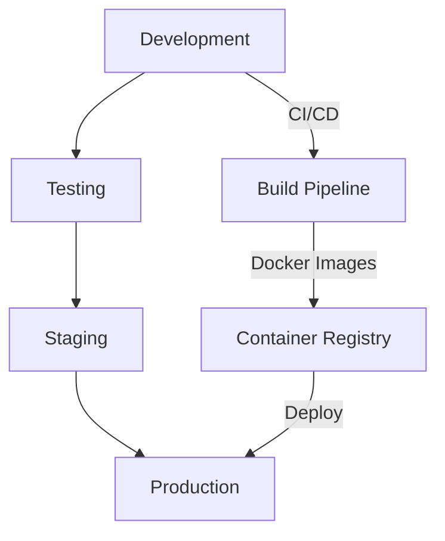

# 🚀 Hướng dẫn Triển khai NextFlow Docker

## 📋 Tổng quan

Tài liệu này cung cấp hướng dẫn chi tiết để triển khai hệ thống NextFlow Docker trong các môi trường khác nhau từ Development đến Production.

## 🏗️ Kiến trúc Triển khai

### 🔄 Các Môi trường



### 🐳 Container Architecture

```
┌─────────────────────────────────────────────────────────────┐
│                    Load Balancer (Nginx)                   │
├─────────────────────────────────────────────────────────────┤
│  App Container 1  │  App Container 2  │  App Container 3  │
├─────────────────────────────────────────────────────────────┤
│     Redis Cache   │    PostgreSQL     │   File Storage    │
├─────────────────────────────────────────────────────────────┤
│   Monitoring      │    Logging        │    Backup         │
└─────────────────────────────────────────────────────────────┘
```

## 🛠️ Chuẩn bị Môi trường

### 📋 System Requirements

#### Development Environment
- **CPU**: 2 cores minimum
- **RAM**: 4GB minimum
- **Storage**: 20GB SSD
- **OS**: Ubuntu 20.04+, macOS 10.15+, Windows 10+

#### Production Environment
- **CPU**: 8 cores minimum (16 cores khuyến nghị)
- **RAM**: 16GB minimum (32GB khuyến nghị)
- **Storage**: 100GB SSD (NVMe khuyến nghị)
- **Network**: 1Gbps bandwidth
- **OS**: Ubuntu 20.04 LTS, CentOS 8+

### 🔧 Software Dependencies

```bash
# Ubuntu/Debian
sudo apt update
sudo apt install -y \
    docker.io \
    docker-compose \
    git \
    curl \
    wget \
    unzip \
    htop \
    nginx \
    certbot

# CentOS/RHEL
sudo yum install -y \
    docker \
    docker-compose \
    git \
    curl \
    wget \
    unzip \
    htop \
    nginx \
    certbot
```

## 📁 Cấu trúc Dự án

```
nextflow-docker/
├── docker-compose.yml              # Main compose file
├── docker-compose.override.yml     # Local overrides
├── docker-compose.prod.yml         # Production config
├── .env.example                    # Environment template
├── .env                           # Environment variables
├── Dockerfile                     # Application container
├── nginx/
│   ├── nginx.conf                 # Nginx configuration
│   └── ssl/                       # SSL certificates
├── scripts/
│   ├── deploy.sh                  # Deployment script
│   ├── backup.sh                  # Backup script
│   └── health-check.sh            # Health check script
├── monitoring/
│   ├── prometheus.yml             # Prometheus config
│   ├── grafana/                   # Grafana dashboards
│   └── alertmanager.yml           # Alert rules
└── docs/
    └── nextflow_docker/           # Documentation
```

## ⚙️ Cấu hình Environment

### 🔐 Environment Variables

#### Core Application
```bash
# Application Settings
APP_NAME=NextFlow
APP_ENV=production
APP_DEBUG=false
APP_URL=https://yourdomain.com
APP_TIMEZONE=Asia/Ho_Chi_Minh

# Database Configuration
DB_CONNECTION=pgsql
DB_HOST=nextflow-db
DB_PORT=5432
DB_DATABASE=nextflow_production
DB_USERNAME=nextflow_user
DB_PASSWORD=your_secure_db_password

# Redis Configuration
REDIS_HOST=nextflow-redis
REDIS_PASSWORD=your_secure_redis_password
REDIS_PORT=6379
REDIS_DB=0

# Cache Configuration
CACHE_DRIVER=redis
SESSION_DRIVER=redis
QUEUE_CONNECTION=redis
```

#### Security Settings
```bash
# JWT Configuration
JWT_SECRET=your_jwt_secret_key_here
JWT_TTL=60
JWT_REFRESH_TTL=20160

# Encryption
APP_KEY=base64:your_32_character_app_key_here
ENCRYPTION_CIPHER=AES-256-CBC

# CORS Settings
CORS_ALLOWED_ORIGINS=https://yourdomain.com
CORS_ALLOWED_METHODS=GET,POST,PUT,DELETE,OPTIONS
CORS_ALLOWED_HEADERS=Content-Type,Authorization,X-Requested-With
```

#### AI Integration
```bash
# Ollama Configuration
OLLAMA_HOST=nextflow-ollama
OLLAMA_PORT=11434
OLLAMA_MODEL=llama2:7b

# Qdrant Vector Database
QDRANT_HOST=nextflow-qdrant
QDRANT_PORT=6333
QDRANT_API_KEY=your_qdrant_api_key

# OpenAI (Optional)
OPENAI_API_KEY=your_openai_api_key
OPENAI_MODEL=gpt-3.5-turbo
```

## 🐳 Docker Configuration

### 📄 docker-compose.yml

```yaml
version: '3.8'

services:
  # Application Container
  nextflow-app:
    build:
      context: .
      dockerfile: Dockerfile
      target: production
    container_name: nextflow-app
    restart: unless-stopped
    environment:
      - APP_ENV=${APP_ENV}
      - DB_HOST=${DB_HOST}
      - REDIS_HOST=${REDIS_HOST}
    volumes:
      - app_data:/var/www/html/storage
      - ./logs:/var/www/html/storage/logs
    networks:
      - nextflow-network
    depends_on:
      - nextflow-db
      - nextflow-redis
    healthcheck:
      test: ["CMD", "curl", "-f", "http://localhost:8000/health"]
      interval: 30s
      timeout: 10s
      retries: 3

  # Database Container
  nextflow-db:
    image: postgres:15-alpine
    container_name: nextflow-db
    restart: unless-stopped
    environment:
      POSTGRES_DB: ${DB_DATABASE}
      POSTGRES_USER: ${DB_USERNAME}
      POSTGRES_PASSWORD: ${DB_PASSWORD}
    volumes:
      - postgres_data:/var/lib/postgresql/data
      - ./backups:/backups
    networks:
      - nextflow-network
    healthcheck:
      test: ["CMD-SHELL", "pg_isready -U ${DB_USERNAME}"]
      interval: 30s
      timeout: 5s
      retries: 5

  # Redis Cache
  nextflow-redis:
    image: redis:7-alpine
    container_name: nextflow-redis
    restart: unless-stopped
    command: redis-server --requirepass ${REDIS_PASSWORD}
    volumes:
      - redis_data:/data
    networks:
      - nextflow-network
    healthcheck:
      test: ["CMD", "redis-cli", "ping"]
      interval: 30s
      timeout: 5s
      retries: 3

  # Nginx Load Balancer
  nextflow-nginx:
    image: nginx:alpine
    container_name: nextflow-nginx
    restart: unless-stopped
    ports:
      - "80:80"
      - "443:443"
    volumes:
      - ./nginx/nginx.conf:/etc/nginx/nginx.conf
      - ./nginx/ssl:/etc/nginx/ssl
      - ./logs/nginx:/var/log/nginx
    networks:
      - nextflow-network
    depends_on:
      - nextflow-app

volumes:
  postgres_data:
    driver: local
  redis_data:
    driver: local
  app_data:
    driver: local

networks:
  nextflow-network:
    driver: bridge
```

### 🔧 Production Overrides

```yaml
# docker-compose.prod.yml
version: '3.8'

services:
  nextflow-app:
    deploy:
      replicas: 3
      resources:
        limits:
          cpus: '2.0'
          memory: 2G
        reservations:
          cpus: '1.0'
          memory: 1G
    logging:
      driver: "json-file"
      options:
        max-size: "10m"
        max-file: "3"

  nextflow-db:
    deploy:
      resources:
        limits:
          cpus: '4.0'
          memory: 8G
        reservations:
          cpus: '2.0'
          memory: 4G
    command: >
      postgres
      -c shared_buffers=2GB
      -c effective_cache_size=6GB
      -c maintenance_work_mem=512MB
      -c checkpoint_completion_target=0.9
      -c wal_buffers=16MB
      -c default_statistics_target=100
      -c random_page_cost=1.1
      -c effective_io_concurrency=200

  nextflow-redis:
    deploy:
      resources:
        limits:
          cpus: '1.0'
          memory: 2G
        reservations:
          cpus: '0.5'
          memory: 1G
    command: >
      redis-server
      --requirepass ${REDIS_PASSWORD}
      --maxmemory 1gb
      --maxmemory-policy allkeys-lru
      --save 900 1
      --save 300 10
      --save 60 10000
```

## 🚀 Deployment Process

### 🔄 CI/CD Pipeline

#### GitHub Actions Example
```yaml
# .github/workflows/deploy.yml
name: Deploy to Production

on:
  push:
    branches: [main]
  pull_request:
    branches: [main]

jobs:
  test:
    runs-on: ubuntu-latest
    steps:
      - uses: actions/checkout@v3
      - name: Run Tests
        run: |
          docker-compose -f docker-compose.test.yml up --build --abort-on-container-exit
          docker-compose -f docker-compose.test.yml down

  build:
    needs: test
    runs-on: ubuntu-latest
    if: github.ref == 'refs/heads/main'
    steps:
      - uses: actions/checkout@v3
      - name: Build and Push Docker Images
        run: |
          docker build -t nextflow-app:${{ github.sha }} .
          docker tag nextflow-app:${{ github.sha }} registry.example.com/nextflow-app:latest
          docker push registry.example.com/nextflow-app:latest

  deploy:
    needs: build
    runs-on: ubuntu-latest
    if: github.ref == 'refs/heads/main'
    steps:
      - name: Deploy to Production
        run: |
          ssh production-server 'cd /opt/nextflow-docker && git pull && docker-compose -f docker-compose.yml -f docker-compose.prod.yml up -d'
```

### 📜 Deployment Script

```bash
#!/bin/bash
# scripts/deploy.sh

set -e

# Configuration
ENVIRONMENT=${1:-production}
BRANCH=${2:-main}
BACKUP_ENABLED=${3:-true}

echo "🚀 Starting deployment to $ENVIRONMENT environment..."

# Pre-deployment checks
echo "🔍 Running pre-deployment checks..."
./scripts/health-check.sh

# Backup current state
if [ "$BACKUP_ENABLED" = "true" ]; then
    echo "💾 Creating backup..."
    ./scripts/backup.sh
fi

# Pull latest changes
echo "📥 Pulling latest changes..."
git fetch origin
git checkout $BRANCH
git pull origin $BRANCH

# Build new images
echo "🔨 Building Docker images..."
docker-compose build --no-cache

# Update containers
echo "🔄 Updating containers..."
if [ "$ENVIRONMENT" = "production" ]; then
    docker-compose -f docker-compose.yml -f docker-compose.prod.yml up -d
else
    docker-compose up -d
fi

# Run migrations
echo "🗄️ Running database migrations..."
docker-compose exec -T nextflow-app php artisan migrate --force

# Clear caches
echo "🧹 Clearing caches..."
docker-compose exec -T nextflow-app php artisan cache:clear
docker-compose exec -T nextflow-app php artisan config:clear
docker-compose exec -T nextflow-app php artisan route:clear

# Health check
echo "🏥 Running post-deployment health check..."
sleep 30
./scripts/health-check.sh

echo "✅ Deployment completed successfully!"
```

## 🔒 Security Configuration

### 🛡️ SSL/TLS Setup

#### Let's Encrypt với Certbot
```bash
# Cài đặt Certbot
sudo apt install certbot python3-certbot-nginx

# Tạo SSL certificate
sudo certbot --nginx -d yourdomain.com -d www.yourdomain.com

# Auto-renewal
sudo crontab -e
# Thêm: 0 12 * * * /usr/bin/certbot renew --quiet
```

#### Nginx SSL Configuration
```nginx
# nginx/nginx.conf
server {
    listen 443 ssl http2;
    server_name yourdomain.com;

    ssl_certificate /etc/nginx/ssl/fullchain.pem;
    ssl_certificate_key /etc/nginx/ssl/privkey.pem;
    
    ssl_protocols TLSv1.2 TLSv1.3;
    ssl_ciphers ECDHE-RSA-AES256-GCM-SHA512:DHE-RSA-AES256-GCM-SHA512;
    ssl_prefer_server_ciphers off;
    
    ssl_session_cache shared:SSL:10m;
    ssl_session_timeout 10m;
    
    add_header Strict-Transport-Security "max-age=63072000" always;
    add_header X-Frame-Options DENY;
    add_header X-Content-Type-Options nosniff;
    
    location / {
        proxy_pass http://nextflow-app:8000;
        proxy_set_header Host $host;
        proxy_set_header X-Real-IP $remote_addr;
        proxy_set_header X-Forwarded-For $proxy_add_x_forwarded_for;
        proxy_set_header X-Forwarded-Proto $scheme;
    }
}

# Redirect HTTP to HTTPS
server {
    listen 80;
    server_name yourdomain.com;
    return 301 https://$server_name$request_uri;
}
```

### 🔐 Database Security

```bash
# PostgreSQL Security Configuration
# postgresql.conf
ssl = on
ssl_cert_file = '/var/lib/postgresql/server.crt'
ssl_key_file = '/var/lib/postgresql/server.key'
ssl_ca_file = '/var/lib/postgresql/root.crt'

# Connection security
listen_addresses = 'localhost'
max_connections = 100
shared_preload_libraries = 'pg_stat_statements'

# Logging
log_statement = 'mod'
log_min_duration_statement = 1000
log_connections = on
log_disconnections = on
```

## 📊 Monitoring và Logging

### 📈 Prometheus Configuration

```yaml
# monitoring/prometheus.yml
global:
  scrape_interval: 15s
  evaluation_interval: 15s

rule_files:
  - "alert_rules.yml"

scrape_configs:
  - job_name: 'nextflow-app'
    static_configs:
      - targets: ['nextflow-app:8000']
    metrics_path: '/metrics'
    scrape_interval: 30s

  - job_name: 'postgres'
    static_configs:
      - targets: ['nextflow-db:5432']
    
  - job_name: 'redis'
    static_configs:
      - targets: ['nextflow-redis:6379']

  - job_name: 'nginx'
    static_configs:
      - targets: ['nextflow-nginx:80']

alerting:
  alertmanagers:
    - static_configs:
        - targets:
          - alertmanager:9093
```

### 📝 Logging Configuration

```yaml
# docker-compose.logging.yml
version: '3.8'

services:
  nextflow-app:
    logging:
      driver: "json-file"
      options:
        max-size: "10m"
        max-file: "5"
        labels: "service=nextflow-app"

  # ELK Stack for centralized logging
  elasticsearch:
    image: docker.elastic.co/elasticsearch/elasticsearch:8.5.0
    environment:
      - discovery.type=single-node
      - "ES_JAVA_OPTS=-Xms1g -Xmx1g"
    volumes:
      - elasticsearch_data:/usr/share/elasticsearch/data

  logstash:
    image: docker.elastic.co/logstash/logstash:8.5.0
    volumes:
      - ./logstash/pipeline:/usr/share/logstash/pipeline
      - ./logs:/logs
    depends_on:
      - elasticsearch

  kibana:
    image: docker.elastic.co/kibana/kibana:8.5.0
    ports:
      - "5601:5601"
    environment:
      ELASTICSEARCH_HOSTS: http://elasticsearch:9200
    depends_on:
      - elasticsearch
```

## 💾 Backup và Recovery

### 🗄️ Database Backup

```bash
#!/bin/bash
# scripts/backup.sh

BACKUP_DIR="./backups"
DATE=$(date +%Y%m%d_%H%M%S)
DB_BACKUP_FILE="$BACKUP_DIR/db_backup_$DATE.sql"
VOLUME_BACKUP_FILE="$BACKUP_DIR/volumes_backup_$DATE.tar.gz"

# Create backup directory
mkdir -p $BACKUP_DIR

# Database backup
echo "📊 Backing up database..."
docker-compose exec -T nextflow-db pg_dump -U $DB_USERNAME $DB_DATABASE > $DB_BACKUP_FILE

# Volume backup
echo "💾 Backing up volumes..."
docker run --rm \
  -v nextflow-docker_postgres_data:/data/postgres \
  -v nextflow-docker_redis_data:/data/redis \
  -v nextflow-docker_app_data:/data/app \
  -v $(pwd)/backups:/backup \
  alpine tar czf /backup/volumes_backup_$DATE.tar.gz /data

# Cleanup old backups (keep last 7 days)
find $BACKUP_DIR -name "*.sql" -mtime +7 -delete
find $BACKUP_DIR -name "*.tar.gz" -mtime +7 -delete

echo "✅ Backup completed: $DB_BACKUP_FILE, $VOLUME_BACKUP_FILE"
```

### 🔄 Recovery Process

```bash
#!/bin/bash
# scripts/restore.sh

BACKUP_FILE=$1
VOLUME_BACKUP_FILE=$2

if [ -z "$BACKUP_FILE" ]; then
    echo "❌ Usage: ./restore.sh <db_backup_file> [volume_backup_file]"
    exit 1
fi

# Stop services
echo "⏹️ Stopping services..."
docker-compose down

# Restore database
echo "📊 Restoring database..."
docker-compose up -d nextflow-db
sleep 10
docker-compose exec -T nextflow-db psql -U $DB_USERNAME -d $DB_DATABASE < $BACKUP_FILE

# Restore volumes if provided
if [ -n "$VOLUME_BACKUP_FILE" ]; then
    echo "💾 Restoring volumes..."
    docker run --rm \
      -v nextflow-docker_postgres_data:/data/postgres \
      -v nextflow-docker_redis_data:/data/redis \
      -v nextflow-docker_app_data:/data/app \
      -v $(pwd)/backups:/backup \
      alpine tar xzf /backup/$(basename $VOLUME_BACKUP_FILE) -C /
fi

# Start all services
echo "🚀 Starting all services..."
docker-compose up -d

echo "✅ Restore completed!"
```

## 🔧 Maintenance và Troubleshooting

### 🏥 Health Check Script

```bash
#!/bin/bash
# scripts/health-check.sh

APP_URL=${APP_URL:-http://localhost:8080}
FAILED=0

echo "🏥 Running health checks..."

# Check application health
echo "🔍 Checking application health..."
if curl -f -s "$APP_URL/health" > /dev/null; then
    echo "✅ Application is healthy"
else
    echo "❌ Application health check failed"
    FAILED=1
fi

# Check database connection
echo "🔍 Checking database connection..."
if docker-compose exec -T nextflow-db pg_isready -U $DB_USERNAME > /dev/null; then
    echo "✅ Database is accessible"
else
    echo "❌ Database connection failed"
    FAILED=1
fi

# Check Redis connection
echo "🔍 Checking Redis connection..."
if docker-compose exec -T nextflow-redis redis-cli ping | grep -q PONG; then
    echo "✅ Redis is accessible"
else
    echo "❌ Redis connection failed"
    FAILED=1
fi

# Check disk space
echo "🔍 Checking disk space..."
DISK_USAGE=$(df / | tail -1 | awk '{print $5}' | sed 's/%//')
if [ $DISK_USAGE -lt 90 ]; then
    echo "✅ Disk space is sufficient ($DISK_USAGE% used)"
else
    echo "⚠️ Disk space is running low ($DISK_USAGE% used)"
    FAILED=1
fi

# Check memory usage
echo "🔍 Checking memory usage..."
MEM_USAGE=$(free | grep Mem | awk '{printf "%.0f", $3/$2 * 100.0}')
if [ $MEM_USAGE -lt 90 ]; then
    echo "✅ Memory usage is normal ($MEM_USAGE% used)"
else
    echo "⚠️ Memory usage is high ($MEM_USAGE% used)"
fi

if [ $FAILED -eq 0 ]; then
    echo "🎉 All health checks passed!"
    exit 0
else
    echo "💥 Some health checks failed!"
    exit 1
fi
```

### 🚨 Common Issues và Solutions

#### Container không start
```bash
# Kiểm tra logs
docker-compose logs [service-name]

# Kiểm tra resource usage
docker stats

# Rebuild container
docker-compose build --no-cache [service-name]
docker-compose up -d [service-name]
```

#### Database connection issues
```bash
# Kiểm tra database status
docker-compose exec nextflow-db pg_isready

# Kiểm tra connections
docker-compose exec nextflow-db psql -U $DB_USERNAME -c "SELECT count(*) FROM pg_stat_activity;"

# Reset connections
docker-compose restart nextflow-db
```

#### Performance issues
```bash
# Kiểm tra resource usage
docker stats --no-stream

# Kiểm tra slow queries
docker-compose exec nextflow-db psql -U $DB_USERNAME -c "SELECT query, mean_time, calls FROM pg_stat_statements ORDER BY mean_time DESC LIMIT 10;"

# Clear caches
docker-compose exec nextflow-app php artisan cache:clear
```

## 📚 Tài liệu Tham khảo

### 🔗 Links Hữu ích
- [Docker Best Practices](https://docs.docker.com/develop/best-practices/)
- [PostgreSQL Performance Tuning](https://wiki.postgresql.org/wiki/Performance_Optimization)
- [Redis Configuration](https://redis.io/topics/config)
- [Nginx Performance Tuning](https://nginx.org/en/docs/)
- [Let's Encrypt Documentation](https://letsencrypt.org/docs/)

### 📖 Tài liệu Liên quan
- [Quick Start Guide](./quick-start-guide.md) - Hướng dẫn bắt đầu nhanh
- [Security Recommendations](./security-recommendations.md) - Khuyến nghị bảo mật
- [Performance Optimization](./performance-optimization.md) - Tối ưu hiệu suất
- [Infrastructure Improvements](./infrastructure-improvements.md) - Cải thiện hạ tầng

---

**Cập nhật**: 2024 | **Version**: 1.0.0 | **NextFlow DevOps Team**