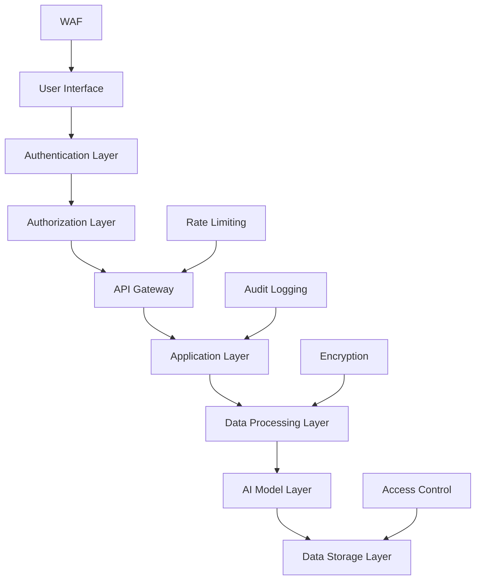

# BẢO MẬT VÀ TUÂN THỦ LANGFLOW TRONG NEXTFLOW CRM

## 🔒 TỔNG QUAN BẢO MẬT

Tài liệu này định nghĩa các yêu cầu bảo mật, chính sách tuân thủ và best practices khi tích hợp Langflow vào NextFlow CRM.

## 🛡️ KIẾN TRÚC BẢO MẬT

### Mô hình bảo mật nhiều lớp


### Nguyên tắc bảo mật cốt lõi
- **Zero Trust Architecture**: Không tin tưởng mặc định
- **Principle of Least Privilege**: Quyền truy cập tối thiểu
- **Defense in Depth**: Bảo vệ nhiều lớp
- **Data Minimization**: Thu thập dữ liệu tối thiểu
- **Privacy by Design**: Bảo mật từ thiết kế

## 🔐 AUTHENTICATION VÀ AUTHORIZATION

### Multi-Factor Authentication (MFA)
```javascript
// MFA Implementation
class MFAService {
    async verifyMFA(userId, token, method) {
        const user = await this.getUserById(userId);
        
        switch (method) {
            case 'totp':
                return this.verifyTOTP(user.totpSecret, token);
            case 'sms':
                return this.verifySMS(user.phone, token);
            case 'email':
                return this.verifyEmail(user.email, token);
            default:
                throw new Error('Invalid MFA method');
        }
    }
    
    async generateTOTPSecret(userId) {
        const secret = speakeasy.generateSecret({
            name: `NextFlow CRM (${userId})`,
            issuer: 'NextFlow'
        });
        
        await this.saveUserSecret(userId, secret.base32);
        return secret.otpauth_url;
    }
}
```

### Role-Based Access Control (RBAC)
```yaml
roles:
  admin:
    permissions:
      - "langflow:*"
      - "workflows:*"
      - "models:*"
      - "data:*"
      
  ai_manager:
    permissions:
      - "langflow:read"
      - "langflow:execute"
      - "workflows:read"
      - "workflows:create"
      - "workflows:update"
      - "models:read"
      
  sales_manager:
    permissions:
      - "langflow:execute:lead_qualification"
      - "langflow:execute:customer_analysis"
      - "workflows:read:sales"
      - "data:read:customers"
      - "data:read:leads"
      
  support_agent:
    permissions:
      - "langflow:execute:customer_support"
      - "workflows:read:support"
      - "data:read:tickets"
      - "data:update:tickets"
      
  marketing_specialist:
    permissions:
      - "langflow:execute:content_generation"
      - "langflow:execute:email_optimization"
      - "workflows:read:marketing"
      - "data:read:campaigns"
```

### JWT Token Security
```javascript
// Secure JWT Implementation
class JWTService {
    constructor() {
        this.accessTokenExpiry = '15m';
        this.refreshTokenExpiry = '7d';
        this.algorithm = 'RS256';
    }
    
    generateTokens(user) {
        const payload = {
            sub: user.id,
            email: user.email,
            roles: user.roles,
            permissions: this.getUserPermissions(user.roles),
            iat: Math.floor(Date.now() / 1000),
            iss: 'nextflow-crm',
            aud: 'langflow-api'
        };
        
        const accessToken = jwt.sign(payload, this.privateKey, {
            algorithm: this.algorithm,
            expiresIn: this.accessTokenExpiry
        });
        
        const refreshToken = jwt.sign(
            { sub: user.id, type: 'refresh' },
            this.refreshSecret,
            { expiresIn: this.refreshTokenExpiry }
        );
        
        return { accessToken, refreshToken };
    }
    
    verifyToken(token) {
        try {
            return jwt.verify(token, this.publicKey, {
                algorithm: this.algorithm,
                issuer: 'nextflow-crm',
                audience: 'langflow-api'
            });
        } catch (error) {
            throw new Error('Invalid token');
        }
    }
}
```

## 🔒 MÃ HÓA DỮ LIỆU

### Encryption at Rest
```javascript
// Database Encryption
class DatabaseEncryption {
    constructor() {
        this.algorithm = 'aes-256-gcm';
        this.keyDerivation = 'pbkdf2';
    }
    
    async encryptSensitiveData(data, context) {
        const key = await this.deriveKey(context);
        const iv = crypto.randomBytes(16);
        const cipher = crypto.createCipher(this.algorithm, key, iv);
        
        let encrypted = cipher.update(JSON.stringify(data), 'utf8', 'hex');
        encrypted += cipher.final('hex');
        
        const authTag = cipher.getAuthTag();
        
        return {
            encrypted,
            iv: iv.toString('hex'),
            authTag: authTag.toString('hex'),
            algorithm: this.algorithm
        };
    }
    
    async decryptSensitiveData(encryptedData, context) {
        const key = await this.deriveKey(context);
        const decipher = crypto.createDecipher(
            encryptedData.algorithm,
            key,
            Buffer.from(encryptedData.iv, 'hex')
        );
        
        decipher.setAuthTag(Buffer.from(encryptedData.authTag, 'hex'));
        
        let decrypted = decipher.update(encryptedData.encrypted, 'hex', 'utf8');
        decrypted += decipher.final('utf8');
        
        return JSON.parse(decrypted);
    }
}
```

### Encryption in Transit
```nginx
# Nginx SSL Configuration
server {
    listen 443 ssl http2;
    server_name langflow.nextflow.com;
    
    # SSL Certificate
    ssl_certificate /etc/ssl/certs/langflow.crt;
    ssl_certificate_key /etc/ssl/private/langflow.key;
    
    # SSL Security
    ssl_protocols TLSv1.2 TLSv1.3;
    ssl_ciphers ECDHE-RSA-AES256-GCM-SHA512:DHE-RSA-AES256-GCM-SHA512:ECDHE-RSA-AES256-GCM-SHA384;
    ssl_prefer_server_ciphers off;
    ssl_session_cache shared:SSL:10m;
    ssl_session_timeout 10m;
    
    # HSTS
    add_header Strict-Transport-Security "max-age=31536000; includeSubDomains" always;
    
    # Security Headers
    add_header X-Frame-Options DENY;
    add_header X-Content-Type-Options nosniff;
    add_header X-XSS-Protection "1; mode=block";
    add_header Referrer-Policy "strict-origin-when-cross-origin";
    
    location / {
        proxy_pass http://langflow-backend;
        proxy_ssl_verify on;
        proxy_ssl_trusted_certificate /etc/ssl/certs/ca-certificates.crt;
    }
}
```

## 🔍 AUDIT LOGGING VÀ MONITORING

### Comprehensive Audit Logging
```javascript
// Audit Logger
class AuditLogger {
    constructor() {
        this.logger = winston.createLogger({
            level: 'info',
            format: winston.format.combine(
                winston.format.timestamp(),
                winston.format.json()
            ),
            transports: [
                new winston.transports.File({ filename: 'audit.log' }),
                new winston.transports.Console()
            ]
        });
    }
    
    logWorkflowExecution(event) {
        this.logger.info('WORKFLOW_EXECUTION', {
            eventType: 'workflow_execution',
            userId: event.userId,
            workflowId: event.workflowId,
            inputData: this.sanitizeData(event.inputData),
            outputData: this.sanitizeData(event.outputData),
            executionTime: event.executionTime,
            success: event.success,
            errorMessage: event.errorMessage,
            timestamp: new Date().toISOString(),
            sessionId: event.sessionId,
            ipAddress: event.ipAddress,
            userAgent: event.userAgent
        });
    }
    
    logDataAccess(event) {
        this.logger.info('DATA_ACCESS', {
            eventType: 'data_access',
            userId: event.userId,
            dataType: event.dataType,
            dataId: event.dataId,
            action: event.action, // read, write, delete
            success: event.success,
            timestamp: new Date().toISOString(),
            ipAddress: event.ipAddress
        });
    }
    
    logSecurityEvent(event) {
        this.logger.warn('SECURITY_EVENT', {
            eventType: 'security_event',
            securityEventType: event.type, // failed_login, suspicious_activity, etc.
            userId: event.userId,
            details: event.details,
            severity: event.severity,
            timestamp: new Date().toISOString(),
            ipAddress: event.ipAddress
        });
    }
    
    sanitizeData(data) {
        // Remove sensitive information from logs
        const sensitiveFields = ['password', 'ssn', 'credit_card', 'api_key'];
        const sanitized = { ...data };
        
        sensitiveFields.forEach(field => {
            if (sanitized[field]) {
                sanitized[field] = '[REDACTED]';
            }
        });
        
        return sanitized;
    }
}
```

### Security Monitoring
```javascript
// Security Monitor
class SecurityMonitor {
    constructor() {
        this.alertThresholds = {
            failedLogins: 5,
            suspiciousRequests: 10,
            dataAccessAnomalies: 3
        };
    }
    
    async monitorFailedLogins(userId, timeWindow = '5m') {
        const failedAttempts = await this.getFailedLoginCount(userId, timeWindow);
        
        if (failedAttempts >= this.alertThresholds.failedLogins) {
            await this.triggerSecurityAlert({
                type: 'MULTIPLE_FAILED_LOGINS',
                userId,
                count: failedAttempts,
                timeWindow
            });
            
            await this.lockUserAccount(userId, '30m');
        }
    }
    
    async detectAnomalousDataAccess(userId, accessPattern) {
        const userProfile = await this.getUserAccessProfile(userId);
        const anomalyScore = this.calculateAnomalyScore(accessPattern, userProfile);
        
        if (anomalyScore > 0.8) {
            await this.triggerSecurityAlert({
                type: 'ANOMALOUS_DATA_ACCESS',
                userId,
                anomalyScore,
                accessPattern
            });
        }
    }
    
    async monitorAPIUsage(apiKey, endpoint, timeWindow = '1h') {
        const requestCount = await this.getAPIRequestCount(apiKey, endpoint, timeWindow);
        const rateLimit = await this.getRateLimit(apiKey, endpoint);
        
        if (requestCount > rateLimit * 1.5) {
            await this.triggerSecurityAlert({
                type: 'API_ABUSE_DETECTED',
                apiKey,
                endpoint,
                requestCount,
                rateLimit
            });
        }
    }
}
```

## 📋 TUÂN THỦ QUY ĐỊNH

### GDPR Compliance
```javascript
// GDPR Compliance Manager
class GDPRCompliance {
    constructor() {
        this.dataRetentionPeriods = {
            'customer_data': '7 years',
            'interaction_logs': '2 years',
            'ai_training_data': '5 years',
            'audit_logs': '10 years'
        };
    }
    
    async handleDataSubjectRequest(requestType, userId, requestData) {
        switch (requestType) {
            case 'access':
                return await this.exportUserData(userId);
            case 'rectification':
                return await this.updateUserData(userId, requestData);
            case 'erasure':
                return await this.deleteUserData(userId);
            case 'portability':
                return await this.exportUserDataPortable(userId);
            case 'restriction':
                return await this.restrictUserDataProcessing(userId);
            default:
                throw new Error('Invalid request type');
        }
    }
    
    async exportUserData(userId) {
        const userData = {
            personalInfo: await this.getPersonalInfo(userId),
            interactionHistory: await this.getInteractionHistory(userId),
            aiProcessingLogs: await this.getAIProcessingLogs(userId),
            preferences: await this.getUserPreferences(userId)
        };
        
        // Log the data export
        await this.auditLogger.logDataAccess({
            userId,
            dataType: 'full_export',
            action: 'export',
            success: true
        });
        
        return userData;
    }
    
    async deleteUserData(userId) {
        // Implement right to be forgotten
        const deletionTasks = [
            this.deletePersonalInfo(userId),
            this.anonymizeInteractionHistory(userId),
            this.removeFromAITrainingData(userId),
            this.deleteUserPreferences(userId)
        ];
        
        await Promise.all(deletionTasks);
        
        // Log the deletion
        await this.auditLogger.logDataAccess({
            userId,
            dataType: 'full_deletion',
            action: 'delete',
            success: true
        });
    }
    
    async checkDataRetention() {
        for (const [dataType, retentionPeriod] of Object.entries(this.dataRetentionPeriods)) {
            const expiredData = await this.findExpiredData(dataType, retentionPeriod);
            
            for (const record of expiredData) {
                await this.archiveOrDeleteData(record, dataType);
            }
        }
    }
}
```

### SOC 2 Type II Compliance
```yaml
soc2_controls:
  security:
    - access_controls:
        description: "Multi-factor authentication required"
        implementation: "MFA enforced for all users"
        testing: "Quarterly access review"
        
    - encryption:
        description: "Data encrypted in transit and at rest"
        implementation: "AES-256 encryption, TLS 1.3"
        testing: "Annual penetration testing"
        
  availability:
    - system_monitoring:
        description: "24/7 system monitoring"
        implementation: "Prometheus + Grafana monitoring"
        testing: "Monthly uptime reporting"
        
    - backup_recovery:
        description: "Regular backups and disaster recovery"
        implementation: "Daily backups, 4-hour RTO"
        testing: "Quarterly DR testing"
        
  processing_integrity:
    - data_validation:
        description: "Input validation and sanitization"
        implementation: "Schema validation, SQL injection prevention"
        testing: "Automated security scanning"
        
    - error_handling:
        description: "Proper error handling and logging"
        implementation: "Structured logging, error tracking"
        testing: "Monthly log review"
        
  confidentiality:
    - data_classification:
        description: "Data classified and handled appropriately"
        implementation: "PII identification and protection"
        testing: "Quarterly data audit"
        
    - access_logging:
        description: "All data access logged and monitored"
        implementation: "Comprehensive audit logging"
        testing: "Monthly access review"
```

### HIPAA Compliance (nếu áp dụng)
```javascript
// HIPAA Compliance for Healthcare Clients
class HIPAACompliance {
    constructor() {
        this.phiFields = [
            'name', 'address', 'birth_date', 'phone', 'email',
            'ssn', 'medical_record_number', 'health_plan_number',
            'account_number', 'certificate_number', 'license_number',
            'vehicle_identifier', 'device_identifier', 'web_url',
            'ip_address', 'biometric_identifier', 'photo'
        ];
    }
    
    identifyPHI(data) {
        const phiFound = [];
        
        for (const [key, value] of Object.entries(data)) {
            if (this.phiFields.includes(key.toLowerCase())) {
                phiFound.push(key);
            }
            
            // Pattern matching for common PHI
            if (this.containsPHIPattern(value)) {
                phiFound.push(key);
            }
        }
        
        return phiFound;
    }
    
    async encryptPHI(data) {
        const phiFields = this.identifyPHI(data);
        const encrypted = { ...data };
        
        for (const field of phiFields) {
            if (encrypted[field]) {
                encrypted[field] = await this.encryptField(encrypted[field]);
            }
        }
        
        return encrypted;
    }
    
    async createBusinessAssociateAgreement(vendor) {
        return {
            vendor: vendor.name,
            agreementDate: new Date().toISOString(),
            obligations: [
                'Safeguard PHI',
                'Report security incidents',
                'Return or destroy PHI upon termination',
                'Ensure subcontractors comply'
            ],
            permittedUses: [
                'AI model training (de-identified)',
                'Customer support automation',
                'Analytics (aggregated)'
            ],
            prohibitedUses: [
                'Marketing to individuals',
                'Sale of PHI',
                'Unauthorized disclosure'
            ]
        };
    }
}
```

## 🔐 API SECURITY

### API Gateway Security
```javascript
// API Security Middleware
class APISecurityMiddleware {
    constructor() {
        this.rateLimiter = new RateLimiter();
        this.validator = new InputValidator();
        this.sanitizer = new DataSanitizer();
    }
    
    async securityMiddleware(req, res, next) {
        try {
            // Rate limiting
            await this.rateLimiter.checkLimit(req.ip, req.path);
            
            // Input validation
            await this.validator.validateRequest(req);
            
            // Data sanitization
            req.body = this.sanitizer.sanitize(req.body);
            
            // SQL injection prevention
            this.preventSQLInjection(req);
            
            // XSS prevention
            this.preventXSS(req);
            
            next();
        } catch (error) {
            res.status(400).json({ error: error.message });
        }
    }
    
    preventSQLInjection(req) {
        const sqlPatterns = [
            /('|(\-\-)|(;)|(\||\|)|(\*|\*))/i,
            /(exec(\s|\+)+(s|x)p\w+)/i,
            /union.*select/i,
            /insert.*into/i,
            /delete.*from/i,
            /update.*set/i
        ];
        
        const checkValue = (value) => {
            if (typeof value === 'string') {
                for (const pattern of sqlPatterns) {
                    if (pattern.test(value)) {
                        throw new Error('Potential SQL injection detected');
                    }
                }
            }
        };
        
        this.traverseObject(req.body, checkValue);
        this.traverseObject(req.query, checkValue);
    }
    
    preventXSS(req) {
        const xssPatterns = [
            /<script[^>]*>.*?<\/script>/gi,
            /<iframe[^>]*>.*?<\/iframe>/gi,
            /javascript:/gi,
            /on\w+\s*=/gi
        ];
        
        const checkValue = (value) => {
            if (typeof value === 'string') {
                for (const pattern of xssPatterns) {
                    if (pattern.test(value)) {
                        throw new Error('Potential XSS attack detected');
                    }
                }
            }
        };
        
        this.traverseObject(req.body, checkValue);
        this.traverseObject(req.query, checkValue);
    }
}
```

### API Key Management
```javascript
// API Key Manager
class APIKeyManager {
    constructor() {
        this.keyRotationInterval = 90 * 24 * 60 * 60 * 1000; // 90 days
    }
    
    async generateAPIKey(userId, permissions, expiresIn = '1y') {
        const keyId = uuidv4();
        const keySecret = crypto.randomBytes(32).toString('hex');
        const hashedSecret = await bcrypt.hash(keySecret, 12);
        
        const apiKey = {
            id: keyId,
            userId,
            hashedSecret,
            permissions,
            createdAt: new Date(),
            expiresAt: new Date(Date.now() + ms(expiresIn)),
            lastUsed: null,
            isActive: true
        };
        
        await this.saveAPIKey(apiKey);
        
        return {
            keyId,
            secret: keySecret,
            fullKey: `${keyId}.${keySecret}`
        };
    }
    
    async validateAPIKey(fullKey) {
        const [keyId, keySecret] = fullKey.split('.');
        
        if (!keyId || !keySecret) {
            throw new Error('Invalid API key format');
        }
        
        const apiKey = await this.getAPIKey(keyId);
        
        if (!apiKey || !apiKey.isActive) {
            throw new Error('Invalid or inactive API key');
        }
        
        if (new Date() > apiKey.expiresAt) {
            throw new Error('API key expired');
        }
        
        const isValid = await bcrypt.compare(keySecret, apiKey.hashedSecret);
        
        if (!isValid) {
            throw new Error('Invalid API key');
        }
        
        // Update last used
        await this.updateLastUsed(keyId);
        
        return apiKey;
    }
    
    async rotateAPIKeys() {
        const expiringSoon = await this.getExpiringKeys(30); // 30 days
        
        for (const key of expiringSoon) {
            await this.notifyKeyExpiration(key);
        }
        
        const expired = await this.getExpiredKeys();
        
        for (const key of expired) {
            await this.deactivateKey(key.id);
        }
    }
}
```

## 🛡️ INCIDENT RESPONSE

### Security Incident Response Plan
```javascript
// Incident Response Manager
class IncidentResponseManager {
    constructor() {
        this.severityLevels = {
            'critical': { responseTime: '15m', escalation: 'immediate' },
            'high': { responseTime: '1h', escalation: '2h' },
            'medium': { responseTime: '4h', escalation: '8h' },
            'low': { responseTime: '24h', escalation: '48h' }
        };
    }
    
    async handleSecurityIncident(incident) {
        const incidentId = uuidv4();
        const severity = this.assessSeverity(incident);
        
        // Log incident
        await this.logIncident({
            id: incidentId,
            type: incident.type,
            severity,
            description: incident.description,
            affectedSystems: incident.affectedSystems,
            detectedAt: new Date(),
            status: 'investigating'
        });
        
        // Immediate response
        await this.immediateResponse(incident, severity);
        
        // Notify stakeholders
        await this.notifyStakeholders(incident, severity);
        
        // Start investigation
        await this.startInvestigation(incidentId);
        
        return incidentId;
    }
    
    async immediateResponse(incident, severity) {
        switch (incident.type) {
            case 'data_breach':
                await this.containDataBreach(incident);
                break;
            case 'unauthorized_access':
                await this.blockUnauthorizedAccess(incident);
                break;
            case 'malware_detected':
                await this.isolateInfectedSystems(incident);
                break;
            case 'ddos_attack':
                await this.activateDDoSProtection(incident);
                break;
        }
    }
    
    async containDataBreach(incident) {
        // Immediate containment steps
        const steps = [
            this.isolateAffectedSystems(incident.affectedSystems),
            this.revokeCompromisedCredentials(incident.compromisedAccounts),
            this.enableAdditionalLogging(),
            this.preserveEvidence(incident)
        ];
        
        await Promise.all(steps);
        
        // Regulatory notification (within 72 hours for GDPR)
        if (this.requiresRegulatoryNotification(incident)) {
            await this.scheduleRegulatoryNotification(incident);
        }
    }
}
```

### Disaster Recovery
```yaml
disaster_recovery_plan:
  rto: "4 hours"  # Recovery Time Objective
  rpo: "1 hour"   # Recovery Point Objective
  
  backup_strategy:
    frequency: "hourly"
    retention: "30 days"
    locations:
      - "primary_datacenter"
      - "secondary_datacenter"
      - "cloud_storage"
      
  recovery_procedures:
    database:
      - "Restore from latest backup"
      - "Apply transaction logs"
      - "Verify data integrity"
      
    application:
      - "Deploy from container registry"
      - "Update configuration"
      - "Perform health checks"
      
    ai_models:
      - "Restore model artifacts"
      - "Reload training data"
      - "Validate model performance"
      
  testing:
    frequency: "quarterly"
    scope: "full_system_recovery"
    success_criteria:
      - "RTO met"
      - "RPO met"
      - "All systems functional"
```

## 📊 SECURITY METRICS VÀ KPI

### Security Dashboard
```javascript
// Security Metrics Collector
class SecurityMetrics {
    async collectMetrics() {
        return {
            authentication: {
                successfulLogins: await this.getSuccessfulLogins('24h'),
                failedLogins: await this.getFailedLogins('24h'),
                mfaAdoption: await this.getMFAAdoptionRate(),
                passwordStrength: await this.getPasswordStrengthMetrics()
            },
            
            access: {
                privilegedAccess: await this.getPrivilegedAccessCount('24h'),
                dataAccess: await this.getDataAccessCount('24h'),
                apiCalls: await this.getAPICallCount('24h'),
                suspiciousActivity: await this.getSuspiciousActivityCount('24h')
            },
            
            vulnerabilities: {
                critical: await this.getCriticalVulnerabilities(),
                high: await this.getHighVulnerabilities(),
                medium: await this.getMediumVulnerabilities(),
                low: await this.getLowVulnerabilities()
            },
            
            incidents: {
                open: await this.getOpenIncidents(),
                resolved: await this.getResolvedIncidents('30d'),
                meanTimeToResolution: await this.getMTTR('30d'),
                falsePositives: await this.getFalsePositiveRate('30d')
            },
            
            compliance: {
                gdprCompliance: await this.getGDPRComplianceScore(),
                soc2Compliance: await this.getSOC2ComplianceScore(),
                auditFindings: await this.getAuditFindings('90d'),
                policyViolations: await this.getPolicyViolations('30d')
            }
        };
    }
}
```

---

*Tài liệu Bảo mật và Tuân thủ Langflow - Phiên bản 1.0*
*Cập nhật lần cuối: [Date]*