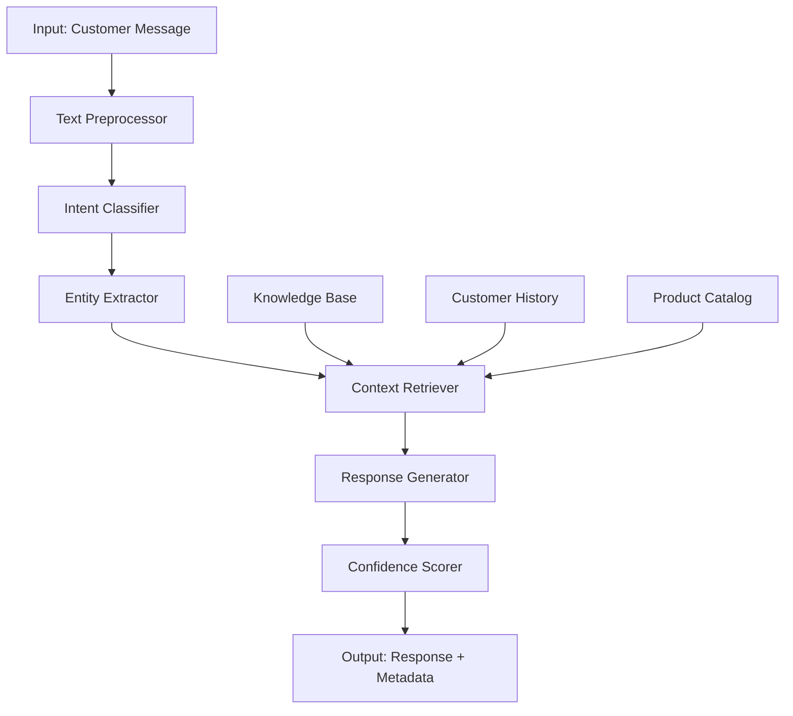
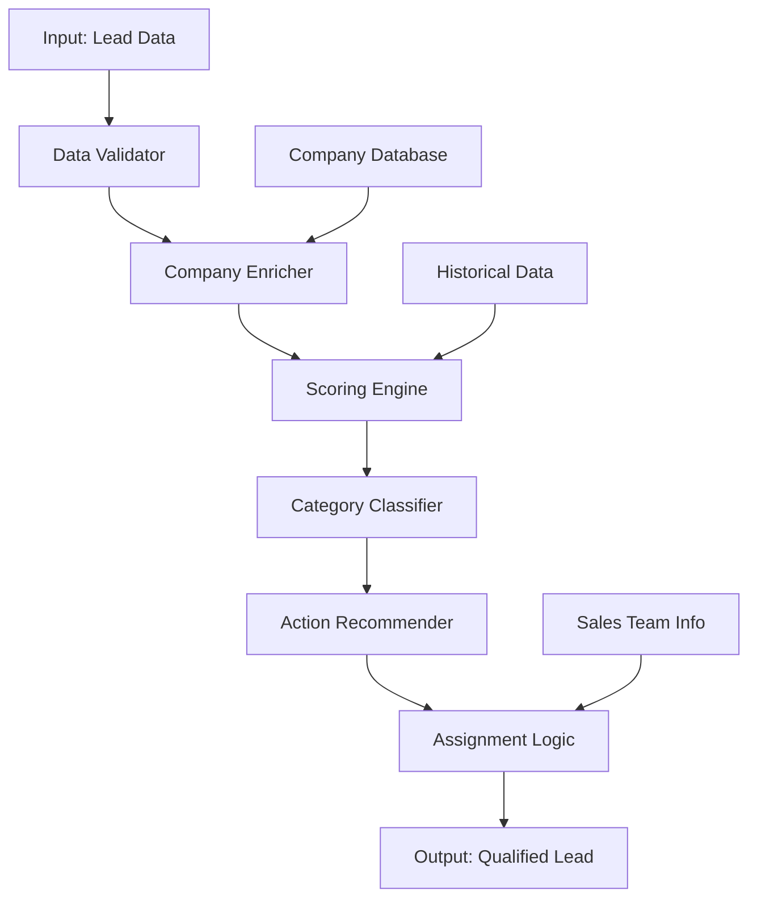
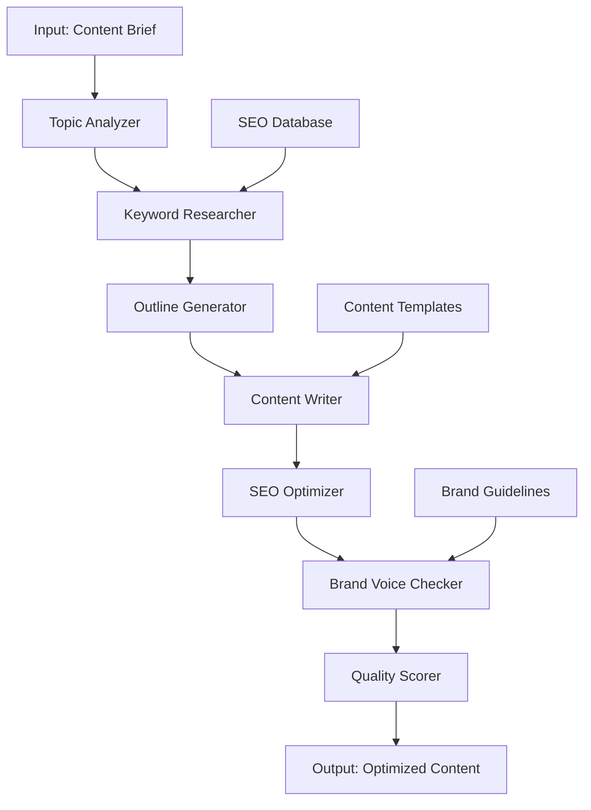
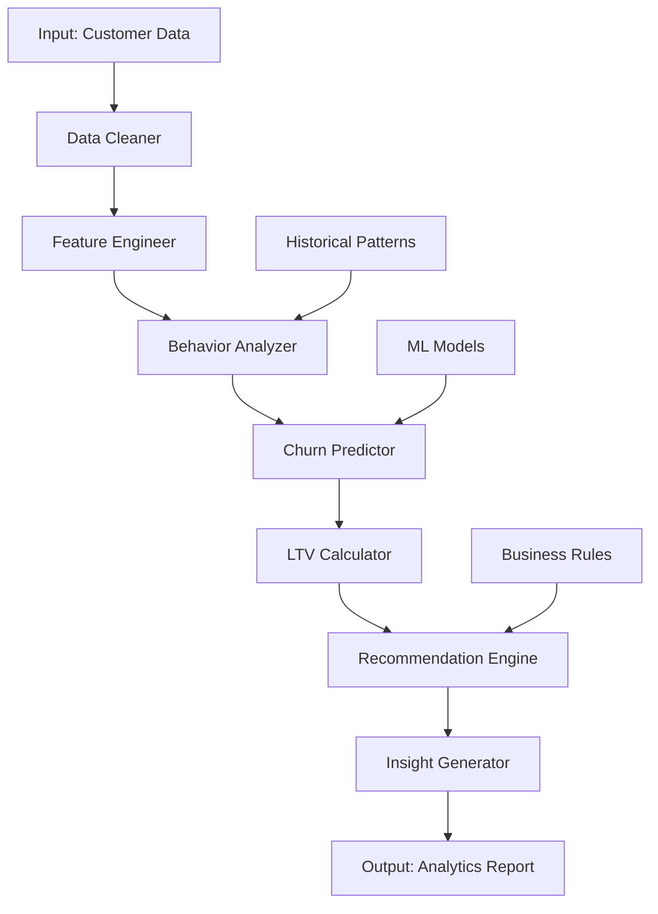
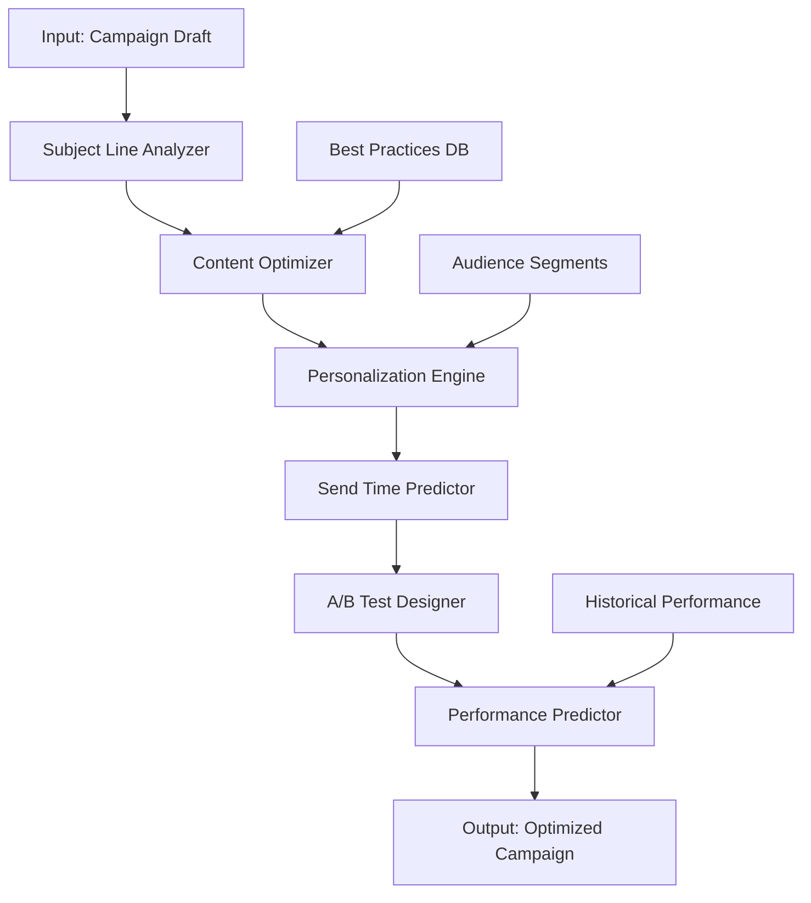

# WORKFLOW TEMPLATES LANGFLOW CHO NEXTFLOW CRM

## 🎯 TỔNG QUAN

Tài liệu này cung cấp các workflow templates có sẵn trong Langflow, được thiết kế đặc biệt cho NextFlow CRM. Mỗi template đã được tối ưu hóa cho các use case cụ thể và có thể customize theo nhu cầu.

## 📋 DANH SÁCH TEMPLATES

### 1. 💬 CUSTOMER SUPPORT CHATBOT

#### Mô tả:
Workflow xử lý tin nhắn khách hàng, phân tích intent và đưa ra phản hồi phù hợp.

#### Components:


#### Input Schema:
```json
{
  "message": "string",
  "customer_id": "string",
  "context": {
    "source": "web|mobile|email",
    "session_id": "string",
    "previous_messages": ["string"]
  },
  "timestamp": "ISO8601"
}
```

#### Output Schema:
```json
{
  "response": "string",
  "confidence": "float (0-1)",
  "intent": "string",
  "entities": {
    "order_id": "string",
    "product_name": "string",
    "date": "string"
  },
  "suggestions": ["string"],
  "requires_human": "boolean",
  "escalation_reason": "string"
}
```

#### Configuration:
```yaml
workflow_name: "customer_support_chatbot"
version: "1.0"
parameters:
  confidence_threshold: 0.7
  max_response_length: 500
  enable_escalation: true
  knowledge_base_id: "kb_customer_support"
  
components:
  text_preprocessor:
    type: "TextCleaner"
    config:
      remove_special_chars: true
      normalize_whitespace: true
      
  intent_classifier:
    type: "IntentClassifier"
    model: "distilbert-base-uncased"
    classes:
      - "order_inquiry"
      - "product_question"
      - "billing_issue"
      - "technical_support"
      - "complaint"
      - "compliment"
      
  entity_extractor:
    type: "NERExtractor"
    model: "en_core_web_sm"
    entities:
      - "ORDER_ID"
      - "PRODUCT_NAME"
      - "DATE"
      - "AMOUNT"
      
  response_generator:
    type: "TemplateGenerator"
    templates:
      order_inquiry: "I'll help you check your order {order_id}. Let me look that up for you."
      product_question: "I'd be happy to help with information about {product_name}."
      default: "Thank you for contacting us. How can I assist you today?"
```

### 2. 🎯 LEAD QUALIFICATION SYSTEM

#### Mô tả:
Workflow đánh giá và phân loại lead dựa trên thông tin cung cấp và dữ liệu lịch sử.

#### Components:


#### Input Schema:
```json
{
  "lead_data": {
    "name": "string",
    "email": "string",
    "phone": "string",
    "company": "string",
    "industry": "string",
    "job_title": "string",
    "budget": "number",
    "timeline": "string",
    "source": "string",
    "notes": "string"
  },
  "form_responses": {
    "pain_points": ["string"],
    "current_solution": "string",
    "decision_maker": "boolean",
    "team_size": "number"
  }
}
```

#### Output Schema:
```json
{
  "qualification_score": "number (0-100)",
  "lead_category": "hot|warm|cold",
  "priority": "high|medium|low",
  "next_actions": ["string"],
  "assigned_to": "string",
  "reasoning": "string",
  "company_insights": {
    "size": "string",
    "revenue": "string",
    "growth_stage": "string"
  },
  "risk_factors": ["string"],
  "opportunities": ["string"]
}
```

#### Scoring Logic:
```python
# Scoring weights
WEIGHTS = {
    'budget_fit': 0.25,
    'timeline_urgency': 0.20,
    'authority_level': 0.20,
    'company_size': 0.15,
    'pain_point_match': 0.10,
    'source_quality': 0.10
}

# Budget scoring
def score_budget(budget, product_price):
    ratio = budget / product_price
    if ratio >= 2.0: return 100
    elif ratio >= 1.5: return 80
    elif ratio >= 1.0: return 60
    elif ratio >= 0.5: return 30
    else: return 0

# Timeline scoring
def score_timeline(timeline):
    timeline_map = {
        'immediate': 100,
        '1_month': 90,
        '3_months': 70,
        '6_months': 50,
        '1_year': 30,
        'no_timeline': 10
    }
    return timeline_map.get(timeline, 0)
```

### 3. ✍️ CONTENT GENERATION ENGINE

#### Mô tả:
Workflow tạo nội dung marketing đa dạng với tối ưu hóa SEO và brand voice.

#### Components:


#### Input Schema:
```json
{
  "content_type": "blog_post|social_media|email_template|product_description",
  "topic": "string",
  "target_audience": "string",
  "brand_voice": "professional|friendly|authoritative|casual",
  "keywords": ["string"],
  "length": "short|medium|long",
  "call_to_action": "string",
  "additional_requirements": "string"
}
```

#### Output Schema:
```json
{
  "generated_content": "string",
  "title": "string",
  "meta_description": "string",
  "tags": ["string"],
  "seo_score": "number (0-100)",
  "readability_score": "number (0-100)",
  "brand_voice_score": "number (0-100)",
  "suggestions": ["string"],
  "word_count": "number",
  "estimated_reading_time": "string"
}
```

#### Content Templates:
```yaml
blog_post:
  structure:
    - "Hook/Introduction"
    - "Problem Statement"
    - "Solution Overview"
    - "Detailed Explanation"
    - "Benefits/Results"
    - "Call to Action"
  
  prompts:
    hook: "Create an engaging opening that captures attention and relates to {topic}"
    problem: "Describe the main challenge or pain point related to {topic}"
    solution: "Explain how {product/service} addresses this challenge"
    
social_media:
  platforms:
    linkedin:
      max_length: 3000
      tone: "professional"
      hashtags: 3-5
    twitter:
      max_length: 280
      tone: "conversational"
      hashtags: 1-3
    facebook:
      max_length: 500
      tone: "friendly"
      hashtags: 2-4
```

### 4. 📊 CUSTOMER ANALYTICS PROCESSOR

#### Mô tả:
Workflow phân tích dữ liệu khách hàng để đưa ra insights và predictions.

#### Components:


#### Input Schema:
```json
{
  "customer_id": "string",
  "analysis_type": "behavior|lifetime_value|churn_risk|preferences",
  "time_period": "7d|30d|90d|1y",
  "include_predictions": "boolean",
  "customer_data": {
    "demographics": {},
    "transaction_history": [],
    "interaction_history": [],
    "support_tickets": [],
    "engagement_metrics": {}
  }
}
```

#### Output Schema:
```json
{
  "insights": {
    "key_findings": ["string"],
    "behavior_patterns": ["string"],
    "trends": ["string"]
  },
  "predictions": {
    "churn_probability": "number (0-1)",
    "lifetime_value": "number",
    "next_purchase_date": "date",
    "preferred_products": ["string"]
  },
  "recommendations": {
    "retention_actions": ["string"],
    "upsell_opportunities": ["string"],
    "engagement_strategies": ["string"]
  },
  "metrics": {
    "engagement_score": "number (0-100)",
    "satisfaction_score": "number (0-100)",
    "loyalty_index": "number (0-100)"
  },
  "risk_factors": ["string"]
}
```

### 5. 📧 EMAIL CAMPAIGN OPTIMIZER

#### Mô tả:
Workflow tối ưu hóa email campaigns để tăng open rates và conversions.

#### Components:


#### Input Schema:
```json
{
  "campaign_data": {
    "subject_line": "string",
    "content": "string",
    "target_segment": "string",
    "campaign_goal": "awareness|conversion|retention",
    "send_date": "date",
    "sender_name": "string"
  },
  "historical_data": {
    "previous_campaigns": [],
    "audience_behavior": {},
    "seasonal_trends": {}
  }
}
```

#### Output Schema:
```json
{
  "optimized_subject": "string",
  "optimized_content": "string",
  "personalization_tokens": ["string"],
  "send_time_recommendation": {
    "optimal_day": "string",
    "optimal_time": "string",
    "timezone": "string"
  },
  "expected_performance": {
    "open_rate": "number",
    "click_rate": "number",
    "conversion_rate": "number"
  },
  "ab_test_variants": [
    {
      "variant_name": "string",
      "subject_line": "string",
      "content_changes": ["string"]
    }
  ],
  "improvements": ["string"]
}
```

## 🛠️ CUSTOM WORKFLOW BUILDER

### Tạo workflow mới:

#### 1. Định nghĩa Use Case
```yaml
workflow_definition:
  name: "custom_workflow_name"
  description: "Workflow description"
  category: "support|sales|marketing|analytics"
  version: "1.0"
  
  inputs:
    - name: "input_name"
      type: "string|number|object|array"
      required: true
      description: "Input description"
      
  outputs:
    - name: "output_name"
      type: "string|number|object|array"
      description: "Output description"
```

#### 2. Component Configuration
```yaml
components:
  - id: "component_1"
    type: "TextProcessor|Classifier|Generator|Analyzer"
    config:
      model: "model_name"
      parameters:
        param1: "value1"
        param2: "value2"
    
  - id: "component_2"
    type: "DatabaseConnector"
    config:
      connection_string: "${DB_CONNECTION}"
      query: "SELECT * FROM table WHERE condition"
```

#### 3. Flow Logic
```yaml
flow:
  - from: "input"
    to: "component_1"
    condition: "always"
    
  - from: "component_1"
    to: "component_2"
    condition: "confidence > 0.8"
    
  - from: "component_1"
    to: "human_escalation"
    condition: "confidence <= 0.8"
    
  - from: "component_2"
    to: "output"
    condition: "always"
```

### Best Practices cho Custom Workflows:

#### Performance Optimization
- **Caching**: Cache kết quả cho inputs tương tự
- **Parallel Processing**: Chạy components độc lập song song
- **Timeout Handling**: Set timeout cho mỗi component
- **Error Recovery**: Implement fallback mechanisms

#### Security Considerations
- **Input Validation**: Validate tất cả inputs
- **Data Sanitization**: Clean sensitive data
- **Access Control**: Restrict workflow access
- **Audit Logging**: Log tất cả executions

#### Monitoring và Debugging
- **Metrics Collection**: Track performance metrics
- **Error Tracking**: Monitor và alert errors
- **Debug Mode**: Enable detailed logging
- **Version Control**: Track workflow changes

## 📚 TEMPLATE LIBRARY

### Industry-Specific Templates:

#### E-commerce
- Product Recommendation Engine
- Inventory Demand Forecasting
- Customer Review Analyzer
- Price Optimization Workflow

#### SaaS
- User Onboarding Optimizer
- Feature Usage Analyzer
- Churn Prevention System
- Support Ticket Classifier

#### Healthcare
- Patient Communication Assistant
- Appointment Scheduler
- Medical Record Analyzer
- Compliance Checker

#### Financial Services
- Risk Assessment Workflow
- Fraud Detection System
- Customer Segmentation Engine
- Regulatory Compliance Monitor

### Template Customization Guide:

#### 1. Clone Template
```bash
langflow clone-template --template-id customer_support_chatbot --name my_custom_chatbot
```

#### 2. Modify Components
```yaml
# Thay đổi model
components:
  intent_classifier:
    model: "your_custom_model"
    classes:
      - "custom_intent_1"
      - "custom_intent_2"
```

#### 3. Update Training Data
```json
{
  "training_data": [
    {
      "text": "I want to cancel my order",
      "intent": "order_cancellation",
      "entities": []
    }
  ]
}
```

#### 4. Test và Deploy
```bash
langflow test --workflow-id my_custom_chatbot --test-data test_cases.json
langflow deploy --workflow-id my_custom_chatbot --environment production
```

## 🔧 TROUBLESHOOTING

### Common Issues:

#### 1. Low Confidence Scores
**Symptoms**: AI outputs có confidence < 70%
**Causes**: 
- Insufficient training data
- Poor input quality
- Model drift

**Solutions**:
- Retrain với more data
- Improve input preprocessing
- Update model version

#### 2. Slow Performance
**Symptoms**: Workflow execution > 30 seconds
**Causes**:
- Large input data
- Complex processing
- Resource constraints

**Solutions**:
- Optimize data processing
- Use caching
- Scale resources

#### 3. Integration Errors
**Symptoms**: Failed API calls, connection timeouts
**Causes**:
- Network issues
- Authentication problems
- API rate limits

**Solutions**:
- Check network connectivity
- Verify credentials
- Implement retry logic

---

*Workflow Templates Langflow - Phiên bản 1.0*
*Cập nhật lần cuối: [Date]*